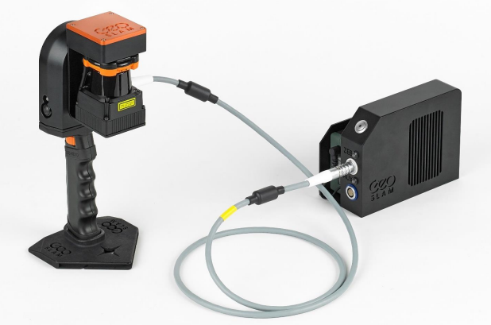

# Summary of hand-held LiDAR Acquisition during Fort Davis Field Exercise.

## Field Operations
During the Fort Davis Field Exercise, hand-held LiDAR (Light Detection
and Ranging) was acquired to evaluate the collection, in-field
processing, and transfer of point cloud (3-dimentional) data to a
centralized server for potential use during an emergency response
scenario. The primary targets (located at Historic Prude Ranch and
McDonald Observatory) were features meant to simulate damaged structures
following a natural disaster event. During the exercise, the team
located seven areas that contained sufficient structures and debris to
simulate the damage and debris following a disaster event. The goal was
to collect point-cloud data in the field, perform initial processing,
and transfer the data to a server in a format that would be useful to
emergency responders.

The LiDAR equipment used for this exercise was the [<u>GeoSLAM ZEB Go
Handheld Scanner</u>](https://geoslam.com/solutions/zeb-go/).

The device consists primarily of a hand-held scanner and data logger
which serves as temporary storage of the raw data files. Additional
components included are a backpack, data cable, USB drives, 12V battery
charger, and batteries. The ZEB Go unit is capable of scanning 43,000
scanner points per second, has a range of 30 meters, and relative
accuracy of 1-3 cm.

The hand-held scanner is comprised of two major components: a 2D
time-of-flight laser range scanner coupled with an inertial measurement
unit (IMU) on a scanning head which continuously rotates during
operation of the scanner.

Operation of the scanner is fairly simple. Once the data logger unit is
powered on and the cable is connected between the logger and scanner, a
simple boot-up procedure is performed with LED lights indicating each
stage of the boot-up. With the data logger stowed in the backpack, the
operator begins a systematic scan of the area of interest, moving the
scanner up and down as they walk. The operator may walk in any
direction, however, the acquisition must end in the approximate position
it which it began (known as loop closure). Upon completion, the raw data
is automatically compressed by the on-board software and is then
manually transferred to a USB drive via the auxiliary port on the data
logger. The proprietary zip files are given names based on date and
time.

The acquisitions varied in duration from 15-20 minutes each. The
batteries (capable of 4 hours of continuous operation) were more than
sufficient to cover 3-4 acquisitions in a day. The included battery
charger was used nightly to recharge the batteries.

Once transferred to a laptop, the FARO Connect software is used to
convert the data to a 3D point cloud. During this process, the 2D laser
data and the IMU data are merged using a 3D “simultaneous localization
and mapping” (SLAM) algorithm. The software is capable of exporting to
any number of common point-cloud formats. For this field exercise, the
files were exported to LAS format which was subsequently imported into
other software for further processing.

More on the post-processing of the raw LiDAR data will be discussed in
another section of this report.

Links:

GeoSLAM ZEB-Go Product Information Page:

[<u>ZEB Go Handheld 3D Scanner: Laser Scanning for Everyone
(geoslam.com)</u>](https://geoslam.com/solutions/zeb-go/)

GeoSLAM ZEB-Go User Guide:

[<u>https://geoslam.com/wp-content/uploads/2021/02/ZEB\_Go\_User\_Guide\_1.0.7.pdf</u>](https://geoslam.com/wp-content/uploads/2021/02/ZEB_Go_User_Guide_1.0.7.pdf)

FARO Connect Software:

[<u>https://www.faro.com/en/Products/Software/FARO-Connect-Software</u>](https://www.faro.com/en/Products/Software/FARO-Connect-Software)

## Post Processing

Faro Connect was the post processing. The Lidar collection starts in a
proprietary .geoslam format that requires this software to download and
process. The software goes through an algorithm to generate both a raw
point cloud and a ‘clean’ version that removes anomalies and outliers
from the cloud. We found the best results using the cleaned version of
the point cloud format. Once exported it was imported into open-source
3d point cloud and mesh processing software CloudCompare.

The point cloud data needed to be reprojected to a real world
projection. To do so, an existing UTM Z13 point cloud from the 2019 USGS
Lidar Campaign for the area was used. The results worked very well with
areas that included easily defined structures for ground truthing. More
work is necessary to rectify results in areas without such features.

After reconciling the point cloud data, it could be imported into ArcGIS
Pro and classified using its geoprocessing tools for LiDAR. After
classification, filtering and surfaces can be created based on the
desired use from DSMs to DTMs.
