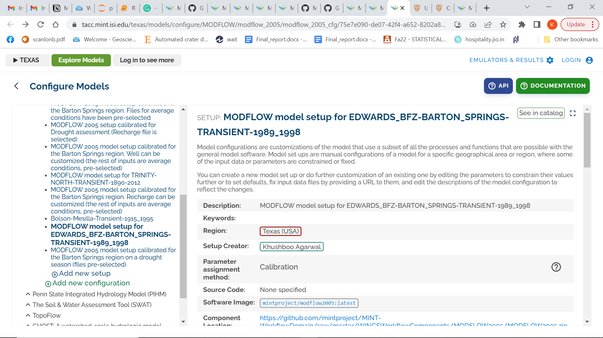
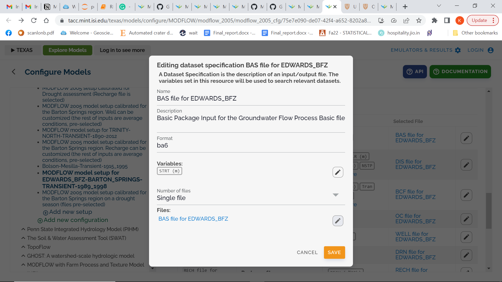
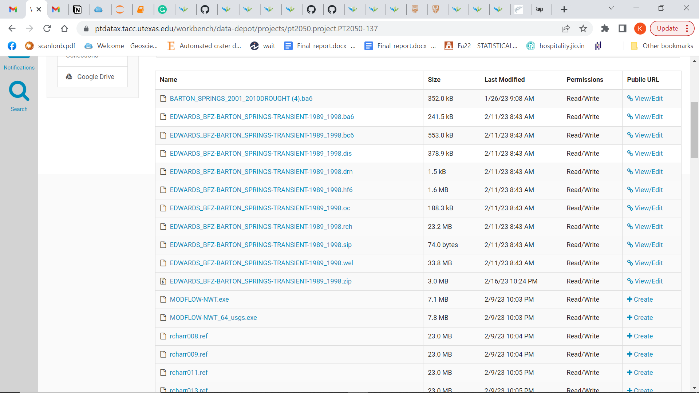
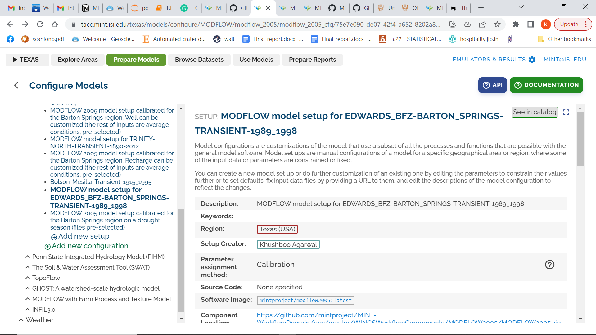
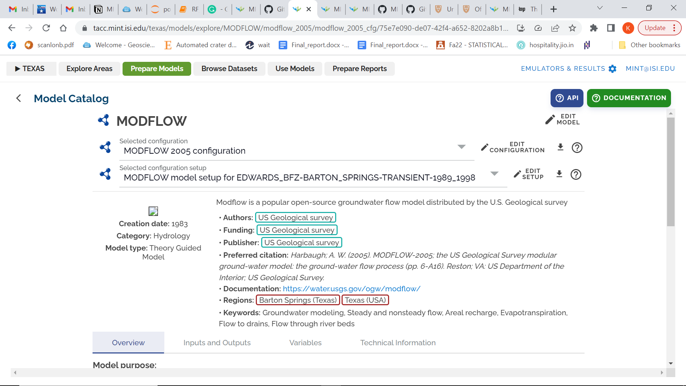
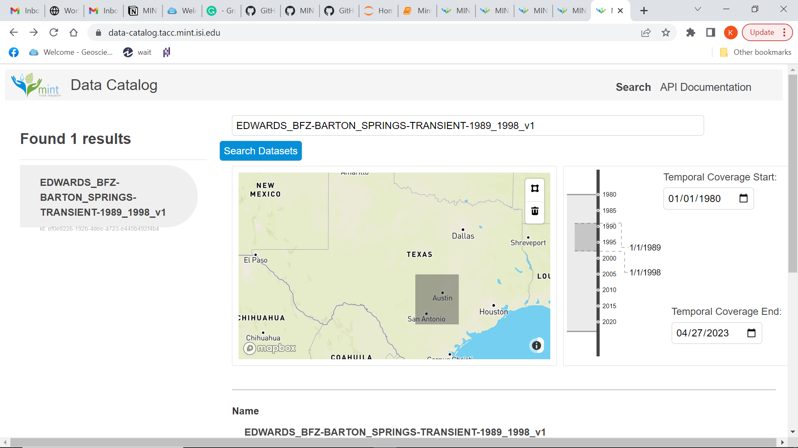
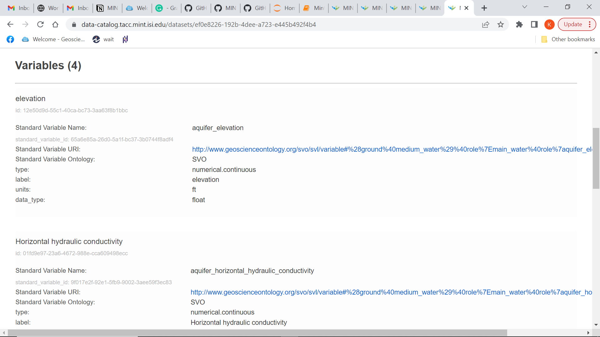
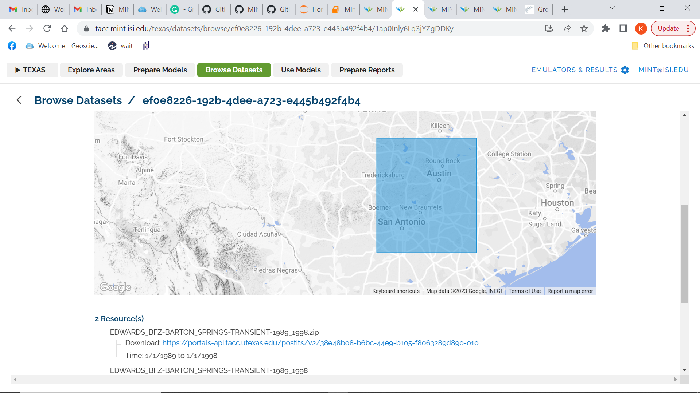

## Model Registration Steps

### Login
First, **login** to <https://tacc.mint.isi.edu/> by using the username and password you received from your contact.

### Configure Model
Select Region -- **Texas** 

Go to **Prepare Models** and then **Configure Models**. Then **Add new setup** under **MODFLOW (in Hydrology).**

For example,

The above model was setup for **EDWARDS BFZ BARTON SPRINGS.** For the setup, we need to add information like the description, Region, setup creator and input parameters. For the input parameters, all the GAM files like . ba6, . dis, . bc6, . dat and . hf6 files need to be registered. An example of registering a bas (.ba6) file can be seen below. The GAM file for Barton Springs was registered by adding external datasets to the 'Files' (as seen in the image below).

### Access Distribution URL for GAML files
Ingest Data into REDI services / Access Distribution URL for the GAM file:
- CL method  --> gives URL back
- In-line using metadata registration tool --> gives URL back
- Method with survey attachments --> gives URL back
- Programmatically with REDI ingest service --> give UID back. that can be used to  construct url from fragment + UID 

To add an external link/dataset, first, go to [https://[ptdatax]{.underline}.tacc.utexas.edu/](https://ptdatax.tacc.utexas.edu/) . Next, go to Data Files - \>\> My Projects - \>\> Add New Project. Then upload the required GAMs and create a public URL. 

This public url can be added to the input parameter in the model setup. An example of public URL can be seen below --

Example of a new setup under modflow - [**https://tacc.mint.isi.edu/texas/models/configure/MODFLOW/modflow_2005/modflow_2005_cfg/75e7e090-de07-42f4-a652-8202a8b1bd2e**](https://tacc.mint.isi.edu/texas/models/configure/MODFLOW/modflow_2005/modflow_2005_cfg/75e7e090-de07-42f4-a652-8202a8b1bd2e)

You can also go to "**see in catalog**" and visit the model catalog page -

This is how the model catalog page looks --

### Register data in catalog

The above steps showed how to create a model setup and hardcode external datasets to configure model. Next, we need to register the data in the catalog - <https://data-catalog.tacc.mint.isi.edu/> using the GitHub code available at - <https://github.com/mintproject/data_registration>

The code needs three files to run -- dataset.json, variables.json and resources.json. See example files : dataset_Barton.json, resources_Barton.json and variables_Barton.json files for more details.

Once, you run the code, you get a record id and name of the model that was registered as seen below -

Registering dataset

{\'result\': \'success\', \'datasets\': \[{\'record_id\': \'ef0e8226-192b-4dee-a723-e445b492f4b4\', \'provenance_id\': \'9ef60317-5da5-4050-8bbc-7d6826fee49f\', \'name\': \'EDWARDS_BFZ-BARTON_SPRINGS-TRANSIENT-1989_1998_v1\', \'description\': \'Groundwater flow model developed for the Barton Springs segment of the Edwards Aquifer developed by the Bureau of Economic Geology, TWDB and Barton Springs Edwards Aquifer Conservation District. This region is hydrologically distinct from other parts of the Edwards Aquifer and is a major source of water.\', \'json_metadata\': {\'temporal_coverage\': {\'start_time\': \'1989-01-01T00:00:00\', \'end_time\': \'1998-01-01T00:00:00\'}, \'datatype\': \'modflow\'}}\]}

Registering Variables

{\'result\': \'success\', \'standard_variables\': \[{\'id\': \'65a6e85a-26d0-5a1f-bc37-3b0744f8adf4\', \'ontology\': \'SVO\', \'name\': \'aquifer_elevation\', \'uri\': \'http://www.geoscienceontology.org/svo/svl/variable#%28ground%40medium_water%29%40role%7Emain_water%40role%7aquifer_elevation\', \'description\': \'\'}, {\'id\': \'97f89b28-0dd7-5a0f-9b16-1c5b779bd93a\', \'ontology\': \'SVO\', \'name\': \'aquifer_specific_yield\', \'uri\': \'http://www.geoscienceontology.org/svo/svl/variable#%28ground%40medium_water%29%40role%7Emain_water%40role%7aquifer_specific_yield\', \'description\': \'\'}, {\'id\': \'9f017e2f-92e1-5fb9-9002-3aee59f3ec83\', \'ontology\': \'SVO\', \'name\': \'aquifer_horizontal_hydraulic_conductivity\', \'uri\': \'http://www.geoscienceontology.org/svo/svl/variable#%28ground%40medium_water%29%40role%7Emain_water%40role%7aquifer_horizontal_hydraulic_conductivity\', \'description\': \'\'}, {\'id\': \'f1ef8bb0-a32c-576e-822d-b3e337580118\', \'ontology\': \'SVO\', \'name\': \'aquifer_specific_storage\', \'uri\': \'http://www.geoscienceontology.org/svo/svl/variable#%28ground%40medium_water%29%40role%7Emain_water%40role%7Ein_recharge\_\_recharge_volume_flux\', \'description\': \'\'}\]}

{\'result\': \'success\', \'variables\': \[{\'record_id\': \'12e50d9d-55c1-40ca-bc73-3aa63f8b1bbc\', \'dataset_id\': \'ef0e8226-192b-4dee-a723-e445b492f4b4\', \'name\': \'elevation\', \'json_metadata\': {\'label\': \'elevation\', \'units\': \'ft\', \'data_type\': \'float\', \'type\': \'numerical.continuous\'}}, {\'record_id\': \'01fd9e97-23a6-4672-988e-cca609498ecc\', \'dataset_id\': \'ef0e8226-192b-4dee-a723-e445b492f4b4\', \'name\': \'Horizontal hydraulic conductivity\', \'json_metadata\': {\'label\': \'Horizontal hydraulic conductivity\', \'units\': \'ft/d\', \'data_type\': \'float\', \'type\': \'numerical.continuous\'}}, {\'record_id\': \'fff39f50-f4c0-4c02-93ef-22f3b867b409\', \'dataset_id\': \'ef0e8226-192b-4dee-a723-e445b492f4b4\', \'name\': \'specific yield\', \'json_metadata\': {\'label\': \'specific yield\', \'units\': \'\', \'data_type\': \'float\', \'type\': \'numerical.continuous\'}}, {\'record_id\': \'9ad79649-496b-4184-bba3-fb05272705be\', \'dataset_id\': \'ef0e8226-192b-4dee-a723-e445b492f4b4\', \'name\': \'specific storage\', \'json_metadata\': {\'label\': \'specific storage\', \'units\': \'ft-1\', \'data_type\': \'float\', \'type\': \'numerical.continuous\'}}\]}

Registering Resources

Registering resource chunk 1

{\'result\': \'success\', \'resources\': \[{\'record_id\': \'c5fd7841-53a1-409f-8cd4-21933b11979a\', \'provenance_id\': \'9ef60317-5da5-4050-8bbc-7d6826fee49f\', \'dataset_id\': \'ef0e8226-192b-4dee-a723-e445b492f4b4\', \'name\': \'EDWARDS_BFZ-BARTON_SPRINGS-TRANSIENT-1989_1998\', \'resource_type\': \'model\', \'data_url\': \'https://tacc.mint.isi.edu/texas/models/configure/MODFLOW/modflow_2005/modflow_2005_cfg/75e7e090-de07-42f4-a652-8202a8b1bd2e\', \'layout\': {}, \'json_metadata\': {\'spatial_coverage\': {\'type\': \'BoundingBox\', \'value\': {\'xmax\': -97, \'xmin\': -99, \'ymax\': 31, \'ymin\': 29}}, \'temporal_coverage\': {\'start_time\': \'1989-01-01T00:00:00\', \'end_time\': \'1998-01-01T00:00:00\'}}}, {\'record_id\': \'09266e1a-e398-4345-a97b-abf9d7a88e06\', \'provenance_id\': \'9ef60317-5da5-4050-8bbc-7d6826fee49f\', \'dataset_id\': \'ef0e8226-192b-4dee-a723-e445b492f4b4\', \'name\': \'EDWARDS_BFZ-BARTON_SPRINGS-TRANSIENT-1989_1998.zip\', \'resource_type\': \'Input data zip file\', \'data_url\': \'https://portals-api.tacc.utexas.edu/postits/v2/38e48b08-b6bc-44e9-b105-f8063289d890-010\', \'layout\': {}, \'json_metadata\': {\'spatial_coverage\': {\'type\': \'BoundingBox\', \'value\': {\'xmax\': -97, \'xmin\': -99, \'ymax\': 31, \'ymin\': 29}}, \'temporal_coverage\': {\'start_time\': \'1989-01-01T00:00:00\', \'end_time\': \'1998-01-01T00:00:00\'}}}\]}

After registering the data, the dataset name \'EDWARDS_BFZ-BARTON_SPRINGS-TRANSIENT-1989_1998_v1\' can be searched on <https://data-catalog.tacc.mint.isi.edu/> as seen below --

The above figure shows both the temporal and spatial information of the dataset. If you click "View more details" you can see detailed information about the variables and resources.

The resources include the link to the model setup and all the GAM files.

Next, you can go to Explore Areas -\>\> Hydrology . If you correctly added the bounding box information in the json file, the hydrology map will show your model.

Ideally, when you click on the location in the hydrology map, it should show your dataset/model. But currently, the above map shows only 11 datasets for each hydrology region so if we keep adding more datasets to any region then you cannot see your data. Since Edwards_9 and Edwards_24 already have 11 models each, I used a different coordinate away from Edwards BFZ Barton Springs for a region which had less than 11 dataset registered in it.

You can also access the model on the hydrology map using the following link (need to add your record id and then the region id after https://tacc.mint.isi.edu/texas/datasets/browse) --

<https://tacc.mint.isi.edu/texas/datasets/browse/ef0e8226-192b-4dee-a723-e445b492f4b4/1ap0Inly6Lq3jYZgDDKy>

**User Comments --**

1.  The search Dataset in <https://data-catalog.tacc.mint.isi.edu/> resets itself to Ethiopia after every search. So, the user needs to refresh the page after every search -

2.  Only 11 models are visible under each hydrology region in the hydrology map. So, your model may not show up in the hydrology map even after adding the correct spatial location. This needs to be fixed.

For example, I registered the Edwards Barton Spring model, which showed up on the hydrology map but disappeared later. This is because the hydrology region where the Barton Spring model was registered, already had 11 models. So, I changed the spatial coverage of this model to make it visible on the hydrology map as seen above (the model is now visible in the Seymour region). If you want to see the model in the correct location, you need to go to - <https://tacc.mint.isi.edu/texas/datasets/browse/ef0e8226-192b-4dee-a723-e445b492f4b4/1ap0Inly6Lq3jYZgDDKy>

Additionally, it is hard to click on smaller regions on the hydrology map.

3.  A user can modify an existing registered model by adding the record id in the dataset.json file but it is hard to overwrite or delete an existing model/dataset. The code keeps appending new information to the existing model but is not able to replace the metadata.

4.  It may be better to use a scripted approach to create the model setup instead of using GUI

5.  It is hard to create a smaller polygon on the hydrology map. Also, it is possible to show a bounding box on the hydrology map but will be useful to know how to show an entire shapefile on the map.

6.  In the model setup process, while uploading an external dataset, the user must manually enter the description twice. It will be better if the interface can inherit the description itself.
